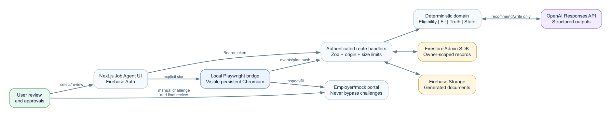
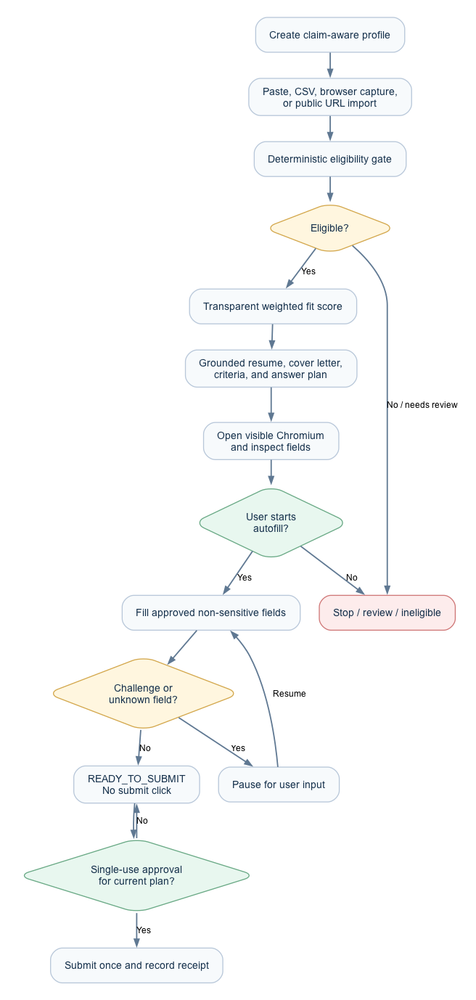

# Job Agent architecture

ApplyFlow keeps one deployable Next.js application and adds a local browser-worker boundary for visible Playwright automation.



## Boundaries

1. The Next.js UI authenticates with Firebase Auth and sends bearer ID tokens to Job Agent route handlers.
2. Route handlers validate payloads with Zod, enforce origin and size controls, and use the Firebase Admin SDK. The browser never receives OpenAI, Firebase Admin, or encryption secrets.
3. Deterministic code owns eligibility, fit weighting, duplicate checks, truth rules, state transitions, and submission approval. Model output cannot override those decisions.
4. The OpenAI Responses API is an optional server-side provider for evidence-grounded writing. Job extraction and every safety decision remain deterministic. Tests and evals use the deterministic provider.
5. Firestore stores user-owned profile, job, application, approval, browser-session, and audit records. Job Agent exports are private local files in version one; durable Firebase Storage upload is still a production follow-up.
6. The Playwright bridge runs locally with a visible persistent Chromium context. It inspects and fills only after user action and stops at `READY_TO_SUBMIT`.

## Main flow



```text
Profile -> import job -> structured extraction -> deterministic eligibility
-> transparent fit score -> grounded documents -> application record
-> inspect form -> review autofill plan -> approve autofill -> fill
-> stop before submit -> single-use submission approval -> submit -> receipt
```

The extension remains a secondary assisted-entry surface. Its legacy automatic submit path is disabled.
